# 🌌 Cosmic Twilight Dream Journal

<p align="center">
  
</p>

<p align="center">
  <b>An immersive, high-contrast Flutter dream journal engineered for lucidity induction, dream recall strengthening, and recurring sign exploration — featuring an interactive force-directed starlight constellation graph, vector sketch canvas, celestial calendar, and zero-pollution demo universe.</b>
</p>

<p align="center">
  
  
  
  
  
  
  
</p>

---

## 🌟 Overview

**Cosmic Twilight Dream Journal** is built on the foundational principles of lucid dream recall. As explored in lucid dreaming research:
> *"Before you can become lucid in your dreams, you need to remember them. Dream recall is the foundation of lucid dreaming. Every time you recall and record a dream, you strengthen the feedback loop between your waking and dreaming mind, reinforcing meta-cognition and personal dream awareness."*

This application digitizes a guided two-page morning journal format into a celestial, dark glassmorphic mobile and desktop experience:

- **⚡ Direct Morning Capture**: The app opens directly to the entry form the instant you wake up, capturing ephemeral dream memories before they fade. Includes a one-tap **"No Recall"** habit keeper to preserve consecutive streaks even on blank nights.
- **🌌 Interactive Dream Signs Constellation**: A custom force-directed physics graph (Coulomb repulsion + Hooke spring attraction) linking recurring symbols, characters, and emotions. Nodes radiate starlight glows; tapping any node presents its all-time appearances, connected dream logs, and **Lucidity Correlation Rate** (e.g., *Flying = 100% Lucid Trigger*).
- **⏱️ Timeline Growth Animation & Scrubber**: Watch your constellation blossom chronologically with a play/pause growth animation and interactive scrubbing slider. Minimizable to a floating capsule control to keep full view of the cosmos.
- **🎨 Interactive Vector Sketch Box**: Finger and stylus drawing canvas with multi-color celestial palette, stroke width steppers, undo, clear, and serialized vector path storage.
- **📅 Celestial Calendar**: Month-view calendar displaying golden stars for lucid dreams, violet markers for recalled dreams, and open circles for no-recall habit logs, paired with selected-day chronicles.
- **🌙 Bedtime Affirmations & Intention Ritual**: Evening ritual screen featuring a pulsating breathing orb and intention setting (*"I will remember my dreams when I wake up"*), along with morning retracing rituals.
- **🧪 Zero-Pollution Demo Mode**: A completely isolated preview sandbox (`dream_journal_demo.db`) pre-loaded with 7 richly interconnected dreams, sketches, and lucidity triggers. Lets anyone test the interactive graph and features without ever polluting personal journal data.

---

## 📱 Visual Feature Tour

### 🌌 App Icon & Atmospheric Splash Screen

| Graph-Inspired App Icon | Animated Cosmic Splash Screen |
| :---: | :---: |
|  | 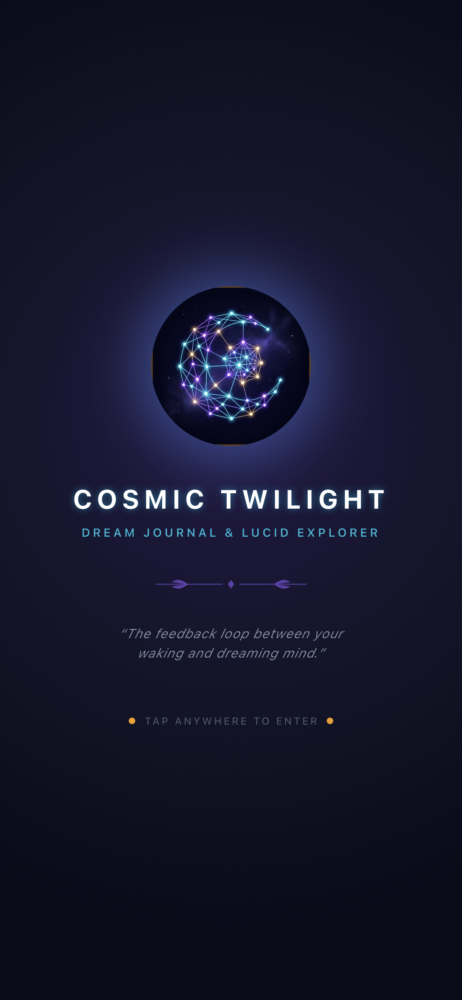 |
| *Luminous constellation nexus forming a crescent moon with cyan, violet, and gold nodes* | *Breathing starlight emblem, local Cinzel serif typography, and tap-to-skip fast morning entry* |

---

### 📖 Guided Morning Capture: Part 1 — Dream Details

| Dream Details (Top) | Dream Details (Scrolled) |
| :---: | :---: |
| 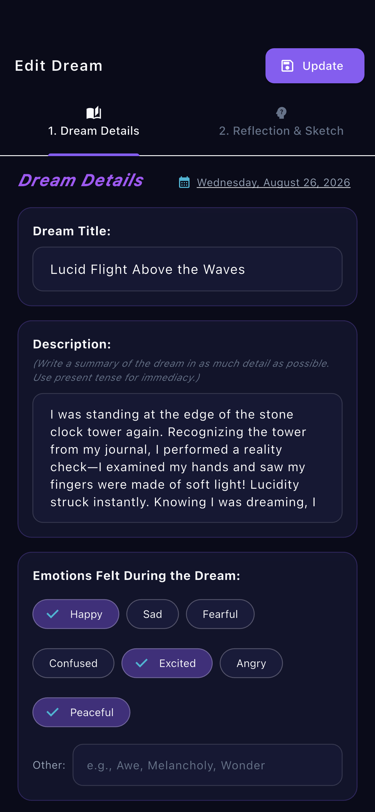 | 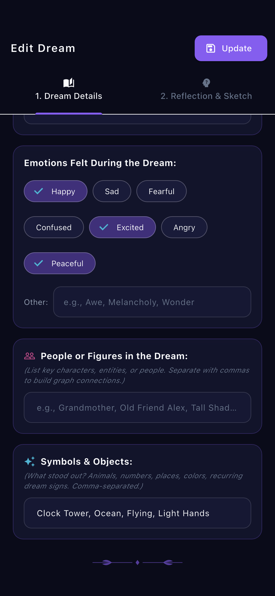 |
| *Title, date picker, and present-tense narrative description* | *Multi-select emotion chips, figures/characters, dream sign symbols, and botanical laurel footer* |

---

### 🎨 Guided Morning Capture: Part 2 — Reflection & Vector Sketch Canvas

| Reflection & Context (Top) | In-App Vector Sketch Canvas (Scrolled) |
| :---: | :---: |
| 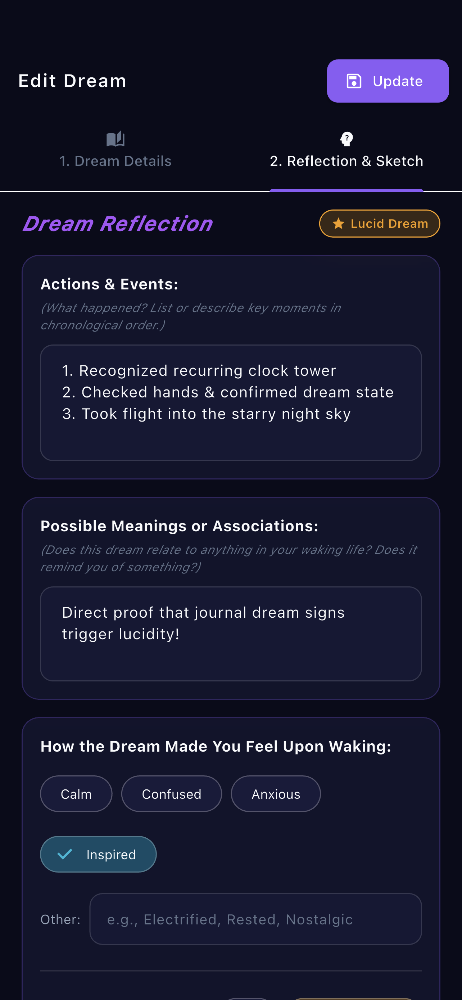 | 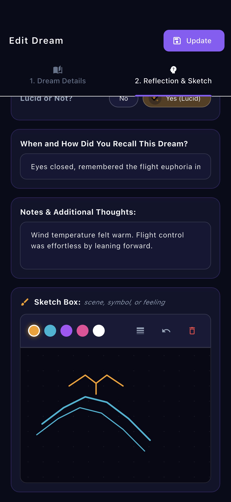 |
| *Chronological actions, waking life associations, waking emotions, and lucidity toggle* | *Recall context, notes, and the interactive drawing canvas with color palette, stroke sizing, and undo* |

---

### 📜 Dream Chronicle Feed & Search

| Chronicle Feed (Top) | Chronicle Feed (Scrolled) |
| :---: | :---: |
| 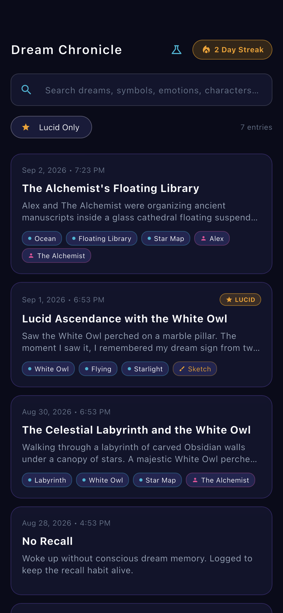 | 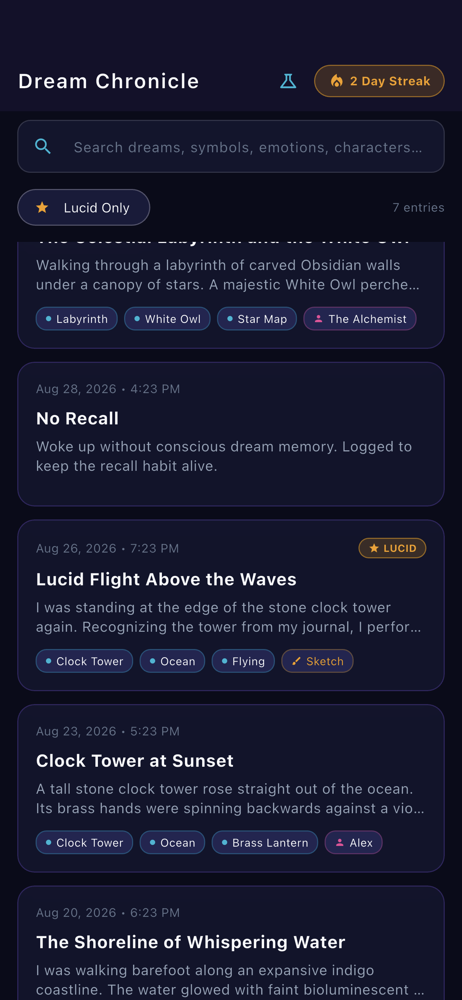 |
| *Instant search across titles/tags, Lucid-only filter, active streak counter, and recent dream cards* | *Scrolled timeline revealing earlier entries, "No Recall" habit keeper cards, and sign badges* |

---

### 🔍 Comprehensive Dream Reader & Vector Artwork

| Dream Narrative Reader (Top) | Reflection & Rendered Sketch (Scrolled) |
| :---: | :---: |
| 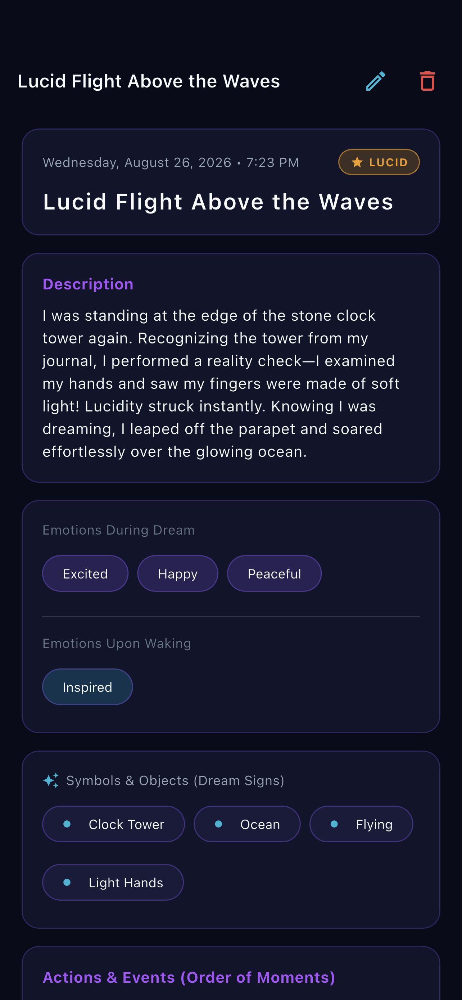 | 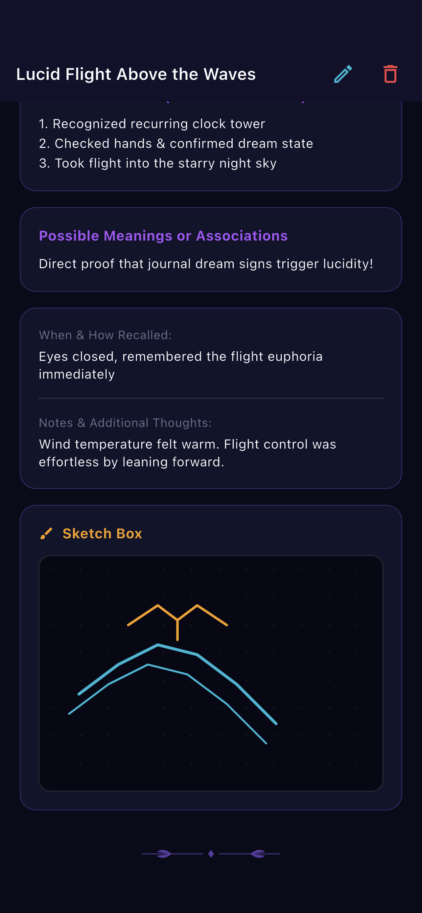 |
| *Full narrative reader with golden lucidity badge, waking emotion tags, and symbol pills* | *Chronological moments, life associations, recall method notes, and embedded vector sketch rendering* |

---

### 🌌 Dream Signs Constellation & Force Physics

| Interactive Constellation Graph | Node Lucidity & Connection Sheet |
| :---: | :---: |
| 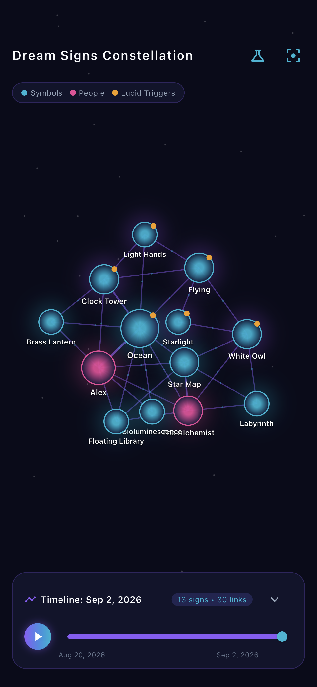 | 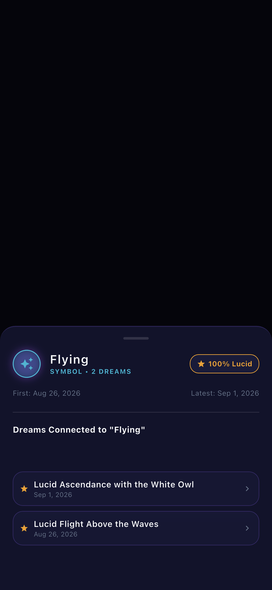 |
| *Real-time force-directed simulation, draggable starlight nodes, nebula links, and collapsible growth scrubber* | *Tapped node modal detailing total appearances, lucidity trigger percentage, and connected dream entries* |

---

### 📅 Celestial Calendar & Bedtime Intention

| Monthly Dream Calendar | Bedtime Affirmations & Breathing Orb |
| :---: | :---: |
| 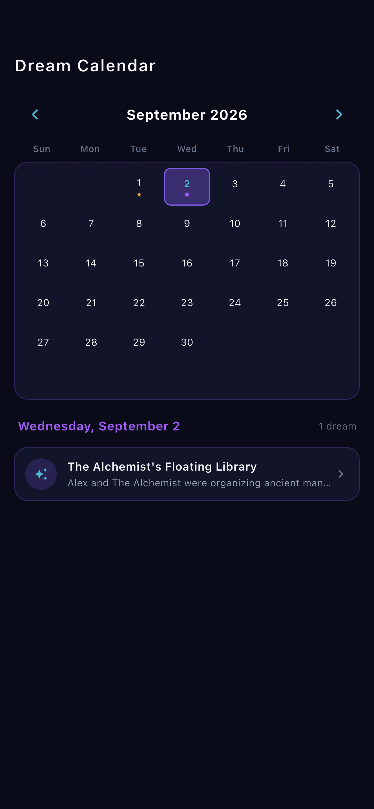 | 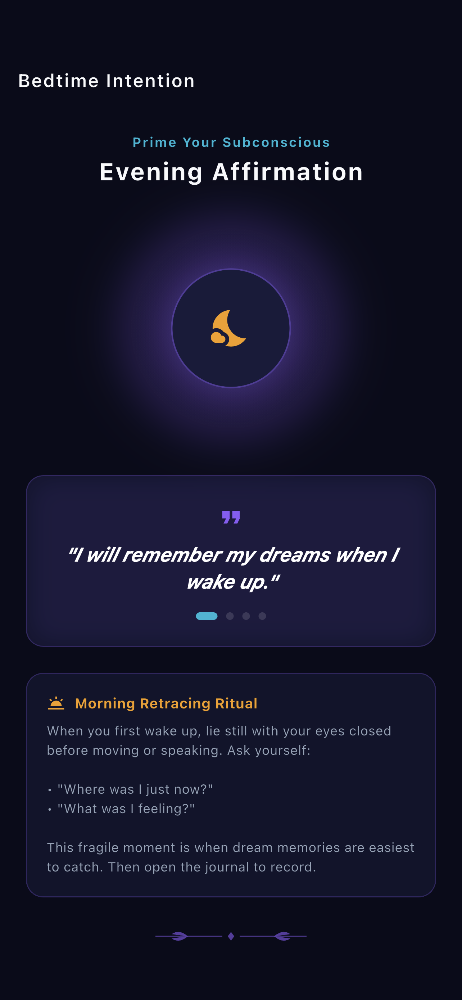 |
| *Monthly calendar with golden stars for lucid dreams, violet dots, and zero-overflow sliver layout* | *Pulsating celestial breathing orb, Chapter 2 subconscious intention setting, and morning retracing ritual* |

---

### 🧪 Zero-Pollution Demo Mode

| Demo Sandbox Universe |
| :---: |
| 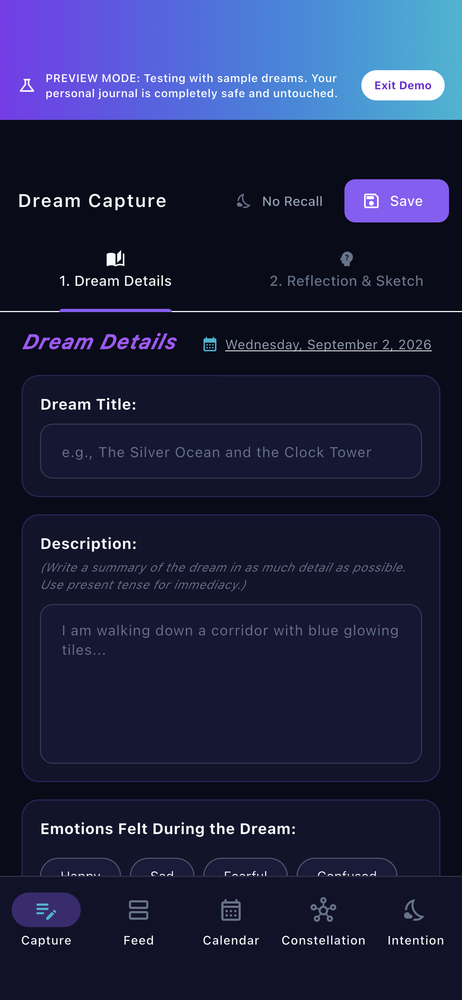 |
| *Top indicator banner clearly identifying preview mode with one-tap instant exit back to personal journal* |

---

## 🏛️ Architecture & Project Structure

```
lib/
├── database/
│   ├── app_database.dart         # SQLite manager (macOS FFI + mobile native, isolated demo DB)
│   └── dream_dao.dart            # Relational CRUD, co-occurrence joins, streaks, search
├── models/
│   ├── dream_entry.dart          # Core DreamEntry model with JSON serialization & tags
│   └── graph_node.dart           # GraphNode & GraphEdge models with lucidity rates & coordinates
├── screens/
│   ├── affirmations/
│   │   └── bedtime_affirmation_screen.dart # Pulsing breathing orb & evening affirmations
│   ├── calendar/
│   │   └── dream_calendar_screen.dart     # Responsive sliver calendar with day dream logs
│   ├── entry/
│   │   ├── dream_details_form.dart        # Page 1 form (Title, Description, Emotions, Symbols)
│   │   ├── dream_reflection_form.dart     # Page 2 form (Chronology, Meanings, Lucidity, Sketch)
│   │   └── new_entry_screen.dart          # Immediate capture landing with tabbed pages & No Recall
│   ├── graph/
│   │   ├── cosmic_graph_canvas.dart       # CustomPainter for stars, nebula lines & physics nodes
│   │   ├── cosmic_graph_screen.dart       # Interactive graph container with pan/zoom & legend
│   │   ├── node_detail_sheet.dart         # Modal bottom sheet for node statistics & connected dreams
│   │   └── timeline_scrubber.dart         # Minimizable timeline scrubber & growth animation
│   ├── list/
│   │   ├── dream_detail_screen.dart       # Full dream reader, editor, and delete actions
│   │   └── dream_list_screen.dart         # Filterable search feed with streak counter
│   └── main_navigation_shell.dart         # Root shell with glassmorphic bottom bar & DemoBanner
├── services/
│   └── demo_data_service.dart     # 7 curated sample dreams with sketches & lucidity triggers
├── state/
│   ├── dream_provider.dart        # Dream list state, search query, streak, demo switching
│   └── graph_provider.dart        # Force physics engine, scrubber progress, timeline animation
├── theme/
│   └── cosmic_theme.dart          # Cosmic Twilight palette, glassmorphism, bundled font styles
└── widgets/
    ├── botanical_divider.dart     # Botanical laurel divider matching book page footers
    ├── cosmic_empty_state.dart    # Celestial empty states with demo mode trigger
    ├── demo_banner.dart           # Glowing banner with one-click "Exit Demo"
    ├── glass_card.dart            # Frosted glass card with backdrop blur & subtle border
    └── sketch_canvas.dart         # Vector drawing canvas with multi-color palette & undo
```

---

## 🔬 Database Architecture & Co-Occurrence Graph

Data is persisted locally in SQLite via `sqflite` (native iOS/Android) and `sqflite_common_ffi` (macOS/Linux/Windows).

### Schema
- `dreams`: Stores primary metadata, narrative description, actions, meanings, lucidity flag, notes, serialized sketch vector paths, and created timestamps.
- `dream_emotions`: Relational table tracking emotions experienced during the dream vs. upon waking.
- `dream_signs`: Relational table indexing extracted symbols, characters, and objects.

### Graph Co-Occurrence Query
The interactive constellation automatically discovers connections between dream signs using an optimized SQL self-join query:
```sql
SELECT 
  s1.name AS source_id, 
  s2.name AS target_id, 
  COUNT(*) AS weight
FROM dream_signs s1
JOIN dream_signs s2 
  ON s1.dream_id = s2.dream_id 
 AND s1.name < s2.name
WHERE s1.dream_id IN (SELECT id FROM dreams WHERE is_no_recall = 0)
GROUP BY s1.name, s2.name;
```

---

## 🚀 Getting Started

### Prerequisites
- [Flutter SDK](https://docs.flutter.dev/get-started/install) (version 3.47+ recommended)
- Xcode (for iOS / macOS development) or Android Studio

### Installation & Run

1. **Clone the repository**:
   ```bash
   git clone git@github.com:drexel-ue/dream_journal.git
   cd dream_journal
   ```

2. **Install dependencies**:
   ```bash
   flutter pub get
   ```

3. **Run on macOS Desktop**:
   ```bash
   flutter run -d macos
   ```

4. **Run on iOS Simulator**:
   ```bash
   flutter run -d "iPhone 12 Pro Max"
   ```

---

## 📸 Automated Screenshot Testing Suite

High-resolution screenshots are captured in an automated integration test suite on the iOS Simulator:

```bash
flutter drive \
  --driver=test_driver/integration_test.dart \
  --target=integration_test/screenshot_test.dart \
  -d "iPhone 12 Pro Max"
```

Screenshots are automatically saved to `screenshots/*.png`.

---

## 🧪 Running Unit & Integration Tests

```bash
flutter test
```
Runs model serialization, force graph physics, sketch path encoding, and SQLite database isolation tests.
